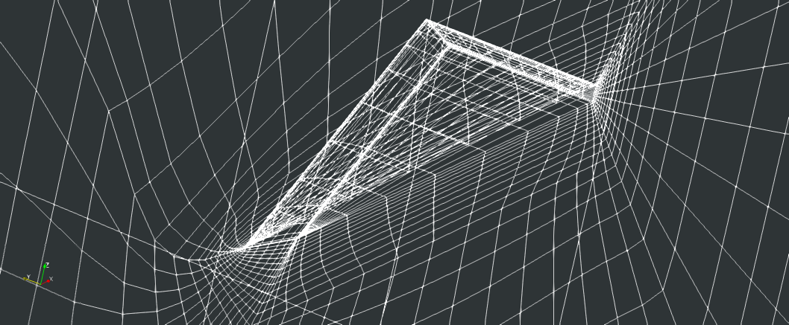
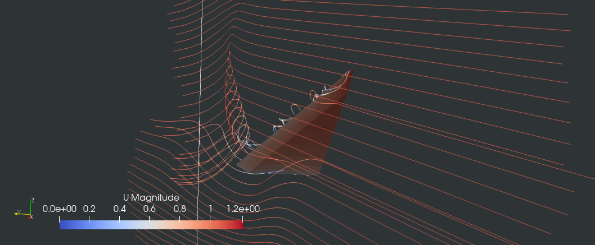

### Laminar Flow around a Delta Wing at high angle of attack. 

The case was used for a High Order Workshop (https://cfd.ku.edu/hiocfd/case_c2.4.html) and was denoted as: Problem C2.4. Laminar Flow around a Delta Wing. On the same website meshes of different reolutions in Gmsh format can be found (https://cfd.ku.edu/hiocfd/delta/).

The case represents a laminar flow at high angle of attack (AoA=12.5 degrees) around a delta wing with a sharp leading edge and a blunt trailing edge. Reynolds number is 4000.

We have used a grid with serial number 3 (delta.3.msh) and we have opened it in Gmsh and saved it to .su2 format.
Note:
We have saved mesh in _SU2_ format - which is possible in Gmsh. We do that because of the mesh conversion tool that we use, and which we will call in the following step. If you haven't done it - you will need to compile __su2ToCappuccino__ which is located in 'utilities' folder of __freeCappuccino__. This program will create mesh files for our simulation. 



To run the code do the following:

Create the folders:  
`mkdir polyMesh vtk vtk/mesh 0`

Run mesh converter:  
`su2ToCappuccino delta3`


Edit polyMesh 'boundary' file to set boundary types like below:

```
# bcName bcType nFaces startFace
Wall wall 896 76576
Symmetry symmetry 1344 77472
Farfield inlet 1088 78816
ZeroMeasureFaces none 192 79904
```

Mesh conversion utility will also create template files for initial conditions in '0' folder. We will open files and edit them.

In 'U' file, change settings to these:  

```
internalField
  uniform
    0.976296007 0.0 0.216439614
boundaryField
Wall
  Dirichlet
    uniform
      0.0 0.0 0.0
Symmetry
  Neumann
    zeroGradient
Farfield
  Dirichlet
    uniform
      0.976296007 0.0 0.216439614
ZeroMeasureFaces
  Neumann
    zeroGradient
```
This sets uniform flow to produce AoA of 12.5 degrees at the delta wing.

Now we are ready to go!

Run the code by executing the run script:

`./run`

While running you may visualy inspect the residuals by calling:

`gnuplot plotResiduals`

or by openning 'monitor' file, where simulation progress is logged, eg by typing:

`tail -n 100 monitor`

When done, open the simulation files from the 'vtk' folder in Paraview.



Try the same with meshes with higher resolution provided at the website above. We also provide here a short PDF document provided to the participants of the workshop.


